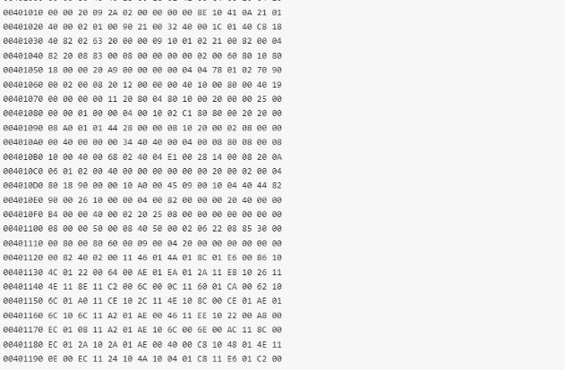
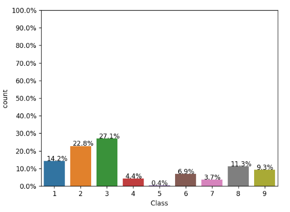

### Classification-of-malware
- In the past few years, the malware industry has grown very rapidly that, the syndicates invest heavily in technologies to evade traditional protection, forcing the anti-malware groups/communities to build more robust softwares to detect and terminate these attacks. 
The major part of protecting a computer system from a malware attack is to identify whether a given piece of file/software is a malware.

### Business and Problem Constraints
- Minimize multi-class error.
- Multi-class probability estimates.
- Malware detection should not take hours and block the user's computer. It should fininsh in a few seconds or a minute.

### Data
- The data is basically .byte and .asm files. 
- Source: https://www.kaggle.com/c/malware-classification
- Example .asm file
    - ASM file
    - 
    
    - BYTE file
    - 
    

### Machine Learning Problem
- Given a file of any format like .byte or .asm predict the type of malware they belong to
- Give probability for each Malware Class
- Types of Malwares
    - Ramnit
    - Lollipop
    - Kelihos_ver3
    - Vundo
    - Simda
    - Tracur
    - Kelihos_ver1
    - Obfuscator.ACY
    - Gatak
 - Type of problem
    - There are nine different classes of malware that we need to classify a given a data point => Multi class classification problem    
 
 ### Performance Metric
    - Multi class log-loss
    - Confusion matrix
 
 ### Train and Test Dataset
    - Splited the dataset randomly into three parts train, cross validation and test with 64%,16%, 20% of data respectively
 
 ### Exploratory Data analysis
    - class Balance
        - 
 
 ### Models 
    - Random Model
    - K Nearest Neighbors
    - logistic Regression (with and without class Imbalance)
    - Random forest
    - XGBoost
    - XGBoost with best hyperparams
    
 
 

